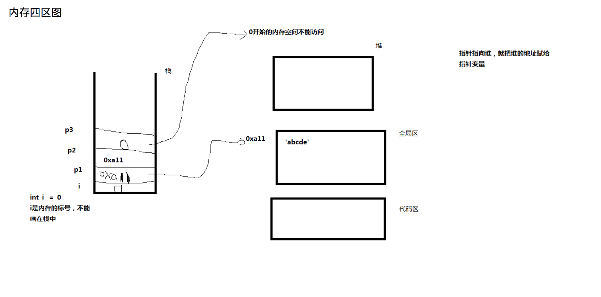

# 内存四区
1.首先我们的代码是放在硬盘上，当我们双击时操作系统将我们的代码load到内存中 。

2.操作系统会把我们的应用程序分成四个区
+ 代码区
  - 放到代码区（程序中定义的变量（a）或者是p = a也是放在代码区）
+ 栈区（也叫临时区）
  - 存放的是局部变量
+ 堆区
  - malloc , new , delete (需要程序猿手工的释放，不释放的话会发生内存泄露)
+ 全局区（常量区）
  - 存放的是全局变量、常量、静态变量

```
#include<stdio.h>
#include<stdlib.h>
#include<string.h>
char * getstring1()
{
    char *p1 = "abcde";//“abcde”是放在全局区
    return p1;
}
char * getstring2()
{
    char *p2 = "abcde";//“abcde”是放在全局区,当这个函数执行完毕后，abcde还在常量区，所以能返回
    return p2;
}
char * getstring3()
{
    char buf[30] = {0};
    strcpy(buf, "abcde");//这个是在栈中，当函数结束之后，所有的在栈中的东西都消失了
    return buf;//你是返回回去一个地址，但是它里面的内容已经变了
    //如果在被调用函数的栈区分配内存，主调用函数是不能使用的
}
void main()
{
    int i= 0;
    char *p1 =  getstring1();
    char *p2 =  getstring2();
    char ******* p3 = NULL;
    printf("p1:%s\n",p1);//从p1的首地址开始打印字符串
    printf("p2:%s\n",p2);
    printf("p1:%d\n",p1);//p1和p2的地址是一样的，为什么呢？
    printf("p2:%d\n",p2);//因为在常量区，如果两个变量时一样的话，就只分配一个内存（c++编译器）
    //指针变量和指针所指向的内存空间变量是不同的概念
    strcmp(p1, p2);//不会比较p1和p2是不是相等，比较的是p1和p2所指向的内存空间的内容是不是一样
    system("pause");
}  
```

