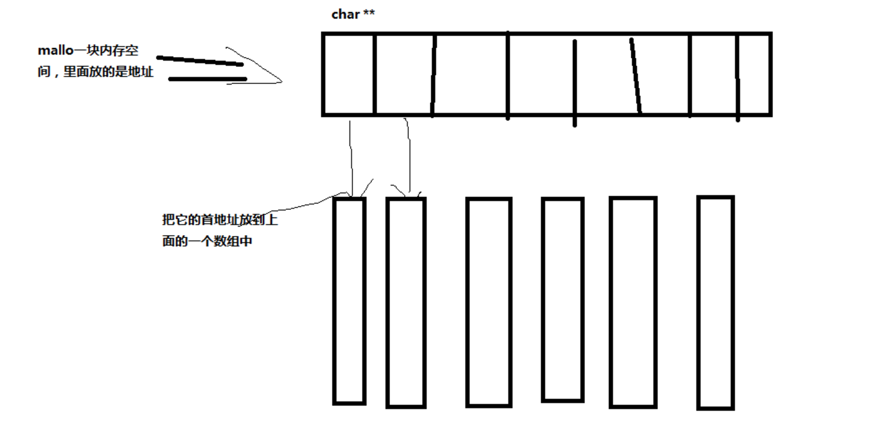

# 二级指针入门

### 1.应该如何理解多级指针
1.首先站在编译器的角度，它就是一个变量，编译器只会把它当做一个指针变量给其分配4个字节。

2.第二个角度：我们只有在使用指针所指向的内存空间的时候，我们才去关心内存时一维的还是二维的。

### 2.二级指针的第一种内存模型
```
#include"stdio.h"
#include"stdlib.h"
#include"string.h"
//二级指针的第一种内存模型
int sortArrayStr(char **array, int num)
{
    //排序
    int i = 0 , j = 0;
    char *tmp = NULL;
    for(i=0; i<num; i++)
    {
        for(j=i+1; j<num; j++)
        {
            if(strcmp(array[i] , array[j]) > 0)
            {
                //这里修改的是指针变量，并没有修改其指向的内容（aaad等是在常量去）
                //数组元素是一个指针变量
                tmp = array[i];
                array[i] = array[j];
                array[j] = tmp;
            }
        }
    }
    return 0;
}
//打印
int printfarray(char **array, int num )
{
    int i = 0;
    for(i = 0; i<num; i++)
    {
        printf("%s\n",array[i]);
    }
    return 0;
}
void main()
{
    //指针数组，里面装的是地址
    char *ArrayStr[] = {"cccc", "aaaa", "bbbb", "11111"};
    sortArrayStr(ArrayStr,4);
    printfarray(ArrayStr, 4);
}  
```
### 2.第二种内存模型
```
int sortArrayStr1(char myarray[10][30], int num)
{
    //排序
    int i = 0 , j = 0;
    char  buf[30] = {0};
    for(i=0; i<num; i++)
    {
        for(j=i+1; j<num; j++)
        {
            if(strcmp(myarray[i] , myarray[j]) > 0)
            {
                strcpy(buf, myarray[i]);
                strcpy(myarray[i], myarray[j]);
                strcpy(myarray[j], buf);
            }
        }
    }
    return 0;
}
int printfarray2(char myarray[10][30], int num )
{
    int i = 0;
    for(i = 0; i<num; i++)
    {
        printf("%s\n",myarray[i]);
    }
    return 0;
}
void main2()
{
    char buf[30] = {0};//buf代表数组首元素的地址
    int i = 0 , j = 0;
    //这里的ccccc,aaaa首先在常量区有一份，然后再往栈区拷贝一份
    char myarray[10][30] = {"cccc", "aaaa", "bbbb", "11111"};//myarray代表什么呢，抛砖
    sortArrayStr1(myarray, 4);
    printfarray2(myarray, 4);
    //printfarray2(myarray[10][30], 4);这个不行，会出错
    system("pause");
}  
```

### 3.第三种内存模型
```
#include"stdio.h"
#include"stdlib.h"
#include"string.h"
//打印
int printarr3(char **arr, int num)//这里arr[10][100]是不行的
{
    int i = 0;
    for(i = 0; i<10; i++)
    {
        printf("%s\n", arr[i]);
    }
    return 0;
}
//排序
int sortarr3(char **arr)
{
    int i = 0  ,  j = 0;
    char buf[30] = {0};
    for(i=0; i<10; i++)
    {
        for(j=i+1; j<10; j++)
        {
            if(strcmp(arr[i] , arr[j]) < 0)
            {
                strcpy(buf, arr[i]);
                strcpy(arr[i], arr[j]);
                strcpy(arr[j], buf);
            }
        }
    }
}
//排序2
int sortarray3(char **array, int num)
{
    int i = 0 , j = 0;
    char *tmp = NULL;
    for(i=0; i<num; i++)
    {
        for(j=i+1; j<num; j++)
        {
            if(strcmp(array[i] , array[j]) > 0)
            {
                //这里修改的是指针变量，并没有修改其指向的内容（aaad等是在常量去）
                //数组元素是一个指针变量
                tmp = array[i];
                array[i] = array[j];
                array[j] = tmp;
            }
        }
    }
    return 0;
}
//朱调函数
void main()
{
    int i = 0 , j = 0;
    char **arr = (char **)malloc(10*sizeof(char *));
    if(arr == NULL)
    {
        return;//一下return到最后一个“{}”
    }
    for(i=0; i<10; i++)
    {
        arr[i] = (char *)malloc(100*sizeof(char));//arr[i]就相当于*(arr+i)
        if(arr[i] == NULL)
        {
            return;//一下return到最后一个“{}”
        }
        sprintf(arr[i], "%d%d%d", i, i, i);
    }
    printf("排序之前：\n");
    //打印
    printarr3(arr, 10);
    //排序
    //sortarr3(char **arr)这两种排序都可以
    sortarray3(arr, 10);
    printf("排序之hou :\n");
    printarr3(arr, 10);
    //释放
    for(i=0; i<10; i++)
    {
        free(arr[i]);
    }
    if(arr != NULL)
    {
        free(arr);
    }
    system("pause");
}  
```


### 4.二级指针做输出（被调函数分配内存）
```
#include <stdio.h>
#include <stdlib.h>
#include <string.h>
//二级指针做输出：在被调用函数中去修改实参
//通过二级指针去修改一级指针的指向（二级指针做输入）
int getMunBuf(char **p2)
{
    char *tmp = (char *)malloc(128);
    *p2 = tmp;
    return 0;
}
void main2()
{
    char *p = NULL;
    getMunBuf(&p);
    printf("%d\n",sizeof(p));
    system("pause");
}
```
也可以使用return语句来使用二级指针
```
#include <stdio.h>
#include <stdlib.h>
#include <string.h>
char **sortArray1Array2(char **pArray1, int nArray3Num, char (*pArray2)[30], int nArray2Num,  int *n1Array3Num)
{
    char tmp[30] = {0};
    int i = 0 , j = 0;
    int length = nArray3Num + nArray2Num;
    char **pTmp = (char **)malloc(length * (sizeof(char *)));
    memset(pTmp, 0 ,sizeof(length * sizeof(char *)));
    for(i=0; i<length; i++)
    {
        pTmp[i] = (char *)malloc(128 * sizeof(char));
        memset(pTmp[i], 0, 128 * sizeof(char));
    }
    for(i=0 ; i<nArray3Num; i++)
    {
        strcpy(pTmp[i],pArray1[i]);
        //j = i;
    }
    for(j = 0; j<nArray2Num; j++)
    {
        strcpy(pTmp[i], pArray2[j]);
        i++;
    }
    for(i=0; i<length; i++)
    {
        for(j=i + 1; j<length; j++)
        {
            if(strcmp(pTmp[i],pTmp[j])>0)
            {
                strcpy(tmp,pTmp[i]);
                strcpy(pTmp[i],pTmp[j]);
                strcpy(pTmp[j],tmp);
            }
        }
    }

    *n1Array3Num = length;
    return pTmp;
}
void freearr(char **arr, int length)
{
    int i = 0;
    if(arr == NULL)
    {
        return;
    }
    for(i=0; i<length; i++)
    {
        if(arr[i] != NULL)
        {
            free(arr[i]);
        }
    }
    if(arr != NULL)
    {
        free(arr);
    }
}
void main1()
{
    int nArray3Num = 0;
    int i = 0;
    char **pArray3 = NULL;
        //指针数组
    char *array1[] = {"bbbbb", "aaaaa", "ccccc", "22222", "11111", "44444"};

    //二维数组
    char array2[10][30] = {"zzzz", "yyyy", "333333"};
    pArray3 = sortArray1Array2(array1, 6, array2, 3, &nArray3Num);
    for(i = 0 ; i < nArray3Num; i++)
    {
        printf("%s\n",pArray3[i]);
    }
    freearr(pArray3,nArray3Num );
    system("pause");
}
```

### 5.二级指针易犯错误
```
#include <stdio.h>
#include <stdlib.h>
#include <string.h>

int getMunBuf1(char **p2)
{
    char *tmp = (char *)malloc(128);
    //错误1：p2指的是一个NULL的空间，不能往里面写东西
    *p2 = tmp;
    return 0;
}
void main11()
{
    char **p = NULL;

    getMunBuf1(p);
    system("pause");
}

void main3()
{
    char buf[10];
    //错误2：buf的值是const的，不能被修改
    getMunBuf1(&buf);
    system("pause");
}
```
